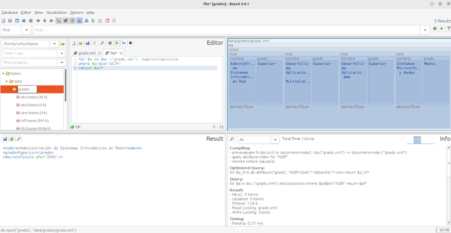
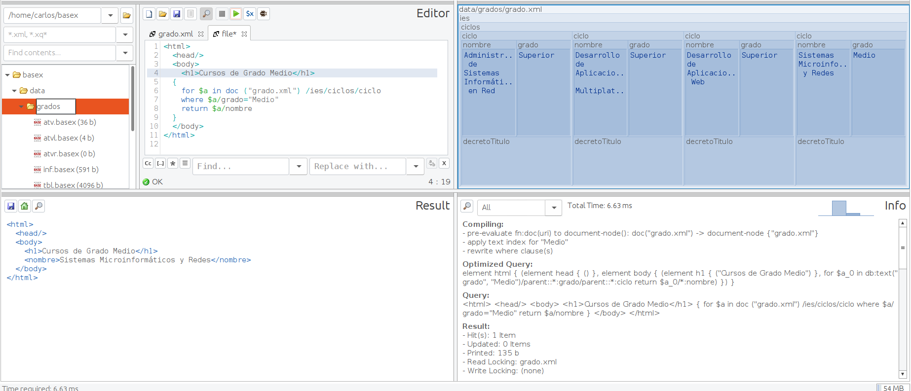
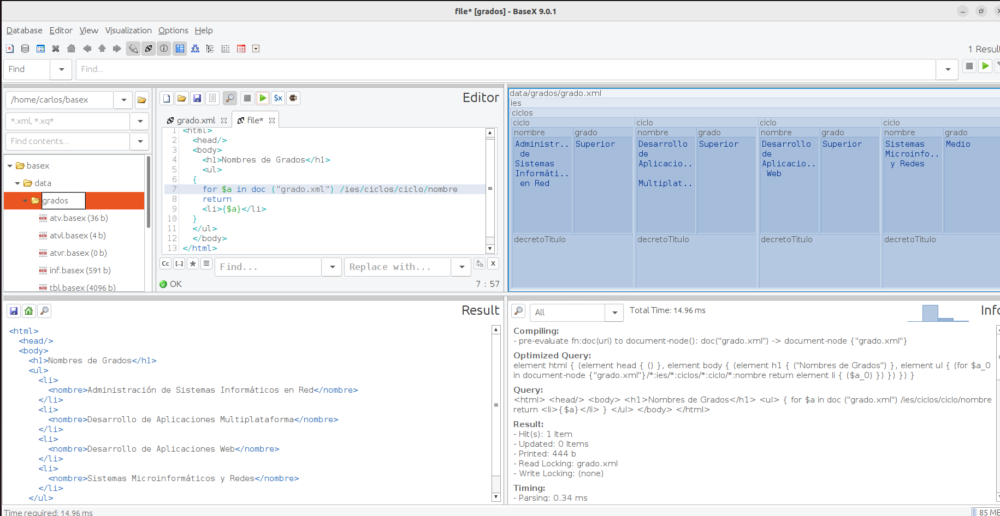

# Xquery

¿Qué es XQuery? ¿Para qué se utiliza?

XQuery es un lenguaje de consulta usado para encontrar y obtener información sobre elementos y atributos en un documento XML con el fin de especificar y realizar una búsqueda de información que nos interesa.

¿Cómo se crea una consulta con XQuery?

En este ejemplo usaremos BaseX. En este caso primero creamos una base de datos arriba izquierda donde pone “Database”, seguido de eso en el editor añadimos nuestro archivo XML, lo guardamos y creamos un documento donde realizaremos las consultas como en este ejemplo :

Aqui sacamos el contenido del ciclo de ASIR.

¿Cuales son las expresiones FLWOR de XQuery?
For
Let
Where
Order by
Return

¿Cómo podemos utilizar XQuery con HTML?

Es fácil, basta con poner las etiquetas y entre llaves la consulta como en este ejemplo :

Aqui sacamos el nombre del ciclo que sea de grado medio.

También podemos sacar el resultado con etiquetas, en este caso en una lista desordenada.

En este ejemplo sacamos el nombre de todos los grados metidos en una lista desordenada

